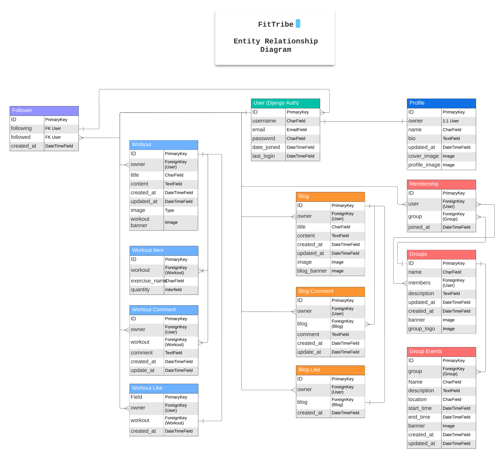

# FitTribe API

Developer : Radleigh Smith

Welcome to the FitTribe API, a comprehensive backend solution for a social fitness application aimed at fostering community engagement and promoting a healthy lifestyle. This API provides the essential infrastructure to support a wide array of features, including user authentication, profile management, content sharing, and interactive functionalities such as likes and comments. Designed with scalability and security in mind, the FitTribe API enables users to connect, share their fitness journeys, participate in groups and events, and stay motivated by following each other's progress. Through its robust and well-documented endpoints, the API ensures a seamless integration with various frontend applications, delivering a dynamic and personalized user experience.

Live links: 

- Live Site: [FitTribe Main Site](https://fittribe-876c83cc52a2.herokuapp.com/)

- Live API Site: [FitTribe API](https://fit-tribe-api-97fb1c20a2ee.herokuapp.com/)

- Frontend Repo: [FitTribe Frontend Repo](https://github.com/RadleighSmith/fit-tribe-frontend)

## Contents
1. [**Planning**](#planning)
    * [API Aims](#api-aims)
    * [User Stories](#user-stories)
    * [Database Schema](#database-schema)
    * [Agile Development](#agile-development)

1. [**Features**](#features)
    * [Current Features](#current-features)
        * [Security](#security)
        * [MODELS GO HERE](#modles-go-here)
    * [Future Features](#future-features)   

1. [Languages](#languages)

1. [Frameworks and Libraries](#frameworks-and-libraries)

1. [Tools and Technologies](#tools-and-technologies)

1. [Testing & Validation](#testing--validation)

1. [Deployment](#deployment)

1. [Cloning this Repository](#cloning-this-repository)

1. [Forking a Branch](#forking-a-branch)

1. [Connecting to this API](#connecting-to-this-api)

1. [Credits](#credits)

1. [Achnowledgements](#acknowledgements)


---
## Planning

### API Aims:

The primary aim of the FitTribe API is to provide a robust and scalable backend service that supports the essential functionalities of a social fitness application. The API is designed to facilitate seamless interaction between users, enabling them to create, share, and interact with fitness-related content. Users can follow each other, post blogs about their fitness journeys, like and comment on posts, and manage their profiles. The API ensures secure authentication and authorization using Django Allauth, ensuring that users' data is protected while offering a personalized and engaging experience.

The FitTribe API encompasses a wide range of features to enhance user engagement and community building. Key features include support for blog posts and workout posts, both of which can be liked and commented on by users. The API also manages user profiles, allowing users to update their personal information and images. Additionally, it supports the creation and management of groups and events, fostering a sense of community among users with shared fitness interests. A dedicated feed feature ensures that users can stay updated with the latest posts from the people they follow, creating a dynamic and interactive experience. By adhering to RESTful principles, the API ensures easy integration with various frontend technologies and the flexibility to accommodate future enhancements as the FitTribe community grows.

### User Stories:

To streamline our development process and ensure a seamless user experience, we have consolidated all user stories within the front-end repository. This approach allows for a cohesive view of user requirements and expectations, facilitating better coordination between the front-end and back-end development. By maintaining user stories in a single location, we can more effectively manage and prioritize features, ensuring that the FitTribe application meets the needs and desires of our users efficiently and comprehensively. You can find the detailed user stories and their corresponding development progress on the front-end repository.

[Find the User Stories here](https://github.com/RadleighSmith/fit-tribe-frontend/issues)

### Database Schema:

The database schema for the FitTribe application was meticulously crafted using [Lucidchart](https://www.lucidchart.com/), a powerful diagramming tool that facilitates the visualization and design of complex database structures. This schema serves as the backbone of our application, ensuring efficient data management and retrieval processes. By employing [Lucidchart](https://www.lucidchart.com/), we were able to create a clear and detailed representation of our database relationships, encompassing user authentication, blog posts, workout posts, likes, comments, profiles, followers, groups, memberships(for Groups) and events.



[Lucidchart](https://www.lucidchart.com/)'s intuitive interface allowed us to map out the relationships between various entities, ensuring that our schema is both comprehensive and scalable. This visual approach not only streamlined the design process but also provided a valuable reference for our development team, aiding in the implementation and maintenance of the database. The resulting schema is robust and well-structured, laying a solid foundation for the FitTribe application's data architecture.

### Agile Development:

The FitTribe API was developed using Agile methodology, emphasizing flexibility, collaboration, and continuous improvement. By adhering to Agile values and principles, we ensured a seamless partnership with the FitTribe frontend application. This approach allowed us to manage project complexities effectively and adapt quickly to changing requirements. The full Agile plan, detailing our iterative development process, can be found in the [FitTribe frontend repository](https://github.com/RadleighSmith/fit-tribe-frontend).

## Features

### Current Features

**Security**

The FitTribe API ensures a high level of security by restricting access to most endpoints to authenticated users only. This section details the security measures implemented to safeguard user data and ensure proper authorization.

**Public Endpoints**

Only the following endpoints are accessible to unauthenticated users:

- Base Root: Provides a welcome message.

- /dj-rest-auth/registration/: Allows new users to register.

- /dj-rest-auth/login/: Allows users to log in.

All other endpoints require the user to be authenticated.

**Authentication and Authorization**

User Authentication: Utilizes Django Allauth for account creation, authentication, and management. This ensures that users can securely register, log in, and manage their profiles.
JWT Tokens: The API uses JSON Web Tokens (JWT) for secure authentication, ensuring that user sessions are safely managed.
Session Authentication: Alongside JWT, session authentication is also supported, providing flexibility in how users authenticate with the API.

**Access Control**

- IsAuthenticated: The default permission class for the API. Only authenticated users can access endpoints beyond the public ones.

- IsOwnerOrReadOnly: This permission class allows read-only access to any request method (GET, HEAD, OPTIONS) for everyone. However, write permissions (POST, PUT, DELETE) are only allowed to the owner of the object.

- IsAdminOrReadOnly: This permission class allows read-only access to any request method (GET, HEAD, OPTIONS) for everyone. Write permissions (POST, PUT, DELETE) are only allowed to admin users, defined as users who have either the is_staff or is_superuser attribute set to True.


**Endpoint-Specific Security**

Profile and Data Security: CRUD operations on user-generated content, such as blogs, workouts, comments, and likes, enforce strict ownership checks. This ensures that only the owner of the content can modify or delete it, safeguarding user data integrity.

Secure Data Handling: All data is rigorously validated and sanitized to prevent common security vulnerabilities, including SQL injection and cross-site scripting (XSS).

Groups and Events Security: Administrative privileges are required to create, update, or delete groups and events. While all users can view group and event information, only authenticated users have the ability to join or leave groups.

Followers Security: Only authenticated users can establish new follower relationships, and only the owner of a follower relationship can remove it.

These security measures ensure that only authorized users can perform specific actions, protecting user data and maintaining the integrity of the application's functionality.

#### Models

**User Model (Django's built in User Model)**

The User model is a built-in Django model that handles the core user attributes and authentication. Below is a table outlining the primary attributes used in the User model for FitTribe:

| Attribute  | Type     | Description                                                    |
|------------|----------|----------------------------------------------------------------|
| username   | String   | A unique identifier for each user. This is the primary attribute used for user login. |
| email      | String   | The email address of the user. Used for account verification, password reset, and other communication purposes. |
| password   | String   | A hashed password for authenticating the user. Stored securely to ensure the protection of user accounts. |

The User model in Django also includes additional fields and methods to handle user permissions, authentication, and profile management.

**Profiles Model**


The Profile model stores additional information for each user in the FitTribe application. Below is a detailed table outlining the attributes of the Profile model:

| Attribute      | Type          | Description                                                                                  |
|----------------|---------------|----------------------------------------------------------------------------------------------|
| owner          | Foreign Key   | A one-to-one relationship with the User model. Indicates the user that this profile belongs to. |
| name           | String        | The real name of the user. Optional.                                                         |
| bio            | Text          | A short bio about the user. Optional.                                                        |
| created_at     | DateTime      | The date and time when the profile was created. Automatically set on creation.               |
| updated_at     | DateTime      | The date and time when the profile was last updated. Automatically updated on save.          |
| profile_image  | Image         | The profile image of the user. Defaults to a placeholder image if not provided.              |
| cover_image    | Image         | The cover image for the user's profile. Defaults to a placeholder image if not provided.     |
| display_name   | Boolean       | Indicates whether to display the real name on the profile. Defaults to `False`.              |

The Profile model is automatically created for each new user using a signal that triggers on user creation.

**Followers Model**

The Follower model represents a follower relationship between two users in the FitTribe application. Below is a detailed table outlining the attributes of the Follower model:

| Attribute  | Type       | Description                                                                                           |
|------------|------------|-------------------------------------------------------------------------------------------------------|
| owner      | Foreign Key| The user who is following another user. This is a ForeignKey linking to the User model with the related name 'following'. |
| followed   | Foreign Key| The user who is being followed. This is a ForeignKey linking to the User model with the related name 'followed'. |
| created_at | DateTime   | The date and time when the follow relationship was created. Automatically set on creation.             |

The Follower model includes metadata to ensure the uniqueness of follower-followed relationships and to provide human-readable names for the model:

- **ordering**: Orders follower records by creation date in descending order.
- **unique_together**: Ensures that a follower-followed relationship is unique.
- **verbose_name**: Adds a readable name for the model in singular form.
- **verbose_name_plural**: Adds a readable name for the model in plural form.

**Blogs Model**

The Blog model represents a blog post created by a user in the FitTribe application. Below is a detailed table outlining the attributes of the Blog model:

| Attribute  | Type       | Description                                                                                           |
|------------|------------|-------------------------------------------------------------------------------------------------------|
| owner      | Foreign Key| The user who owns the blog post. This is a ForeignKey linking to the User model.                      |
| title      | CharField  | The title of the blog post.                                                                           |
| content    | TextField  | The content of the blog post.                                                                         |
| created_at | DateTime   | The date and time when the blog post was created. Automatically set on creation.                      |
| updated_at | DateTime   | The date and time when the blog post was last updated. Automatically set on update.                   |
| banner     | ImageField | Optional banner image for the blog post, with a default image.                                        |
| image      | ImageField | Optional content image for the blog post, with a default image set for consistent referencing.        |

The Blog model includes metadata to ensure proper ordering and representation of the blog posts:

- **ordering**: Blog posts are ordered by creation date, with the newest posts appearing first.

**Blog Likes Model**

The BlogLike model represents a like given by a user to a blog post in the FitTribe application. Below is a detailed table outlining the attributes of the BlogLike model:

| Attribute  | Type       | Description                                                                                        |
|------------|------------|----------------------------------------------------------------------------------------------------|
| owner      | Foreign Key| The user who likes the blog post. This is a ForeignKey linking to the User model.                  |
| blog       | Foreign Key| The blog post that is liked. This is a ForeignKey linking to the Blog model with a related name of 'blog_likes'. |
| created_at | DateTime   | The date and time when the like was created. Automatically set on creation.                        |

The BlogLike model includes metadata to ensure proper ordering and uniqueness:

- **ordering**: Blog likes are ordered by creation date, with the newest likes appearing first.
- **unique_together**: Ensures that a user can like a specific blog post only once.

**Blog Comments Model**

The Blog Comment model represents a comment made by a user on a blog post in the FitTribe application. Below is a detailed table outlining the attributes of the Blog Comment model:

| Attribute  | Type       | Description                                                                                       |
|------------|------------|---------------------------------------------------------------------------------------------------|
| owner      | Foreign Key| The user who made the comment. This is a ForeignKey linking to the User model.                    |
| blog       | Foreign Key| The blog post that is commented on. This is a ForeignKey linking to the Blog model.               |
| comment    | TextField  | The text content of the comment.                                                                  |
| created_at | DateTime   | The date and time when the comment was created. Automatically set on creation.                    |
| updated_at | DateTime   | The date and time when the comment was last updated. Automatically set on update.                 |

The Blog Comment model includes metadata to ensure proper ordering:

- **ordering**: Blog comments are ordered by creation date, with the newest comments appearing first.

**Workouts Model**

The Workout model represents a workout session created by a user in the FitTribe application. Below is a detailed table outlining the attributes of the Workout model:

| Attribute  | Type       | Description                                                                                       |
|------------|------------|---------------------------------------------------------------------------------------------------|
| owner      | Foreign Key| The user who owns the workout session. This is a ForeignKey linking to the User model.            |
| title      | CharField  | The title of the workout session.                                                                 |
| content    | TextField  | The detailed description or content of the workout session.                                       |
| created_at | DateTime   | The date and time when the workout session was created. Automatically set on creation.            |
| updated_at | DateTime   | The date and time when the workout session was last updated. Automatically set on update.         |
| banner     | ImageField | Optional banner image for the workout session, with a default image.                              |
| image      | ImageField | Optional content image for the workout session, with a default image.                             |

The Workout model includes metadata to ensure proper ordering:

- **ordering**: Workout sessions are ordered by creation date, with the newest sessions appearing first.

**Workout Item Model**

The Workout Item model represents individual exercises or components of a workout session in the FitTribe application. Below is a detailed table outlining the attributes of the Workout Item model:

| Attribute     | Type         | Description                                                                                       |
|---------------|--------------|---------------------------------------------------------------------------------------------------|
| workout       | Foreign Key  | The workout session that the exercise belongs to. This is a ForeignKey linking to the Workout model. |
| exercise_name | CharField    | The name of the exercise.                                                                         |
| quantity      | IntegerField | The quantity or amount of the exercise performed.                                                 |

**Workout Likes Model**

The WorkoutLike model represents a like given by a user to a workout session in the FitTribe application. Below is a detailed table outlining the attributes of the WorkoutLike model:

| Attribute  | Type       | Description                                                                                       |
|------------|------------|---------------------------------------------------------------------------------------------------|
| owner      | Foreign Key| The user who liked the workout session. This is a ForeignKey linking to the User model.           |
| workout    | Foreign Key| The workout session that was liked. This is a ForeignKey linking to the Workout model.            |
| created_at | DateTime   | The date and time when the like was created. Automatically set on creation.                       |

The WorkoutLike model includes metadata to ensure proper ordering and uniqueness:

- **ordering**: Likes are ordered by creation date, with the newest likes appearing first.
- **unique_together**: Ensures that a user can only like a specific workout session once.

**Workouts Comments Model**

The WorkoutComment model represents a comment made by a user on a workout session in the FitTribe application. Below is a detailed table outlining the attributes of the WorkoutComment model:

| Attribute  | Type       | Description                                                                                       |
|------------|------------|---------------------------------------------------------------------------------------------------|
| owner      | Foreign Key| The user who made the comment. This is a ForeignKey linking to the User model.                    |
| workout    | Foreign Key| The workout session that the comment pertains to. This is a ForeignKey linking to the Workout model.|
| comment    | TextField  | The text content of the comment.                                                                  |
| created_at | DateTime   | The date and time when the comment was created. Automatically set on creation.                    |
| updated_at | DateTime   | The date and time when the comment was last updated. Automatically set on update.                 |

The WorkoutComment model includes metadata to ensure proper ordering:

- **ordering**: Comments are ordered by creation date, with the newest comments appearing first.

**Groups Model**

The Group model represents a fitness group in the application. Below is a detailed table outlining the attributes of the Group model:

| Attribute   | Type           | Description                                                                                      |
|-------------|----------------|--------------------------------------------------------------------------------------------------|
| name        | CharField      | The name of the group.                                                                           |
| members     | ManyToManyField| The users who are members of the group, linked through the Membership model.                      |
| description | TextField      | A description of the group.                                                                      |
| updated_at  | DateTime       | The date and time when the group was last updated. Automatically set on update.                  |
| created_at  | DateTime       | The date and time when the group was created. Automatically set on creation.                     |
| banner      | ImageField     | An optional banner image for the group, with a default image.                                    |
| group_logo  | ImageField     | An optional logo image for the group, with a default image.                                      |

The Group model includes metadata to ensure proper ordering and naming:

- **ordering**: Groups are ordered by creation date, with the newest groups appearing first.
- **verbose_name**: Readable name for the model in singular form.
- **verbose_name_plural**: Readable name for the model in plural form.

**Membership Model**

The Membership model represents the relationship between a user and a group. Below is a detailed table outlining the attributes of the Membership model:

| Attribute  | Type        | Description                                                             |
|------------|-------------|-------------------------------------------------------------------------|
| user       | ForeignKey  | The user who is a member of the group. This links to the User model.    |
| group      | ForeignKey  | The group the user is a member of. This links to the Group model.       |
| joined_at  | DateTime    | The date and time when the user joined the group. Automatically set on creation.|

**Group Events Model**

The GroupEvent model represents events within groups that users can join. Below is a detailed table outlining the attributes of the GroupEvent model:

| Attribute    | Type          | Description                                                                                   |
|--------------|---------------|-----------------------------------------------------------------------------------------------|
| group        | ForeignKey    | The parent group to which the event belongs. Links to the Group model.                        |
| name         | CharField     | The name of the event.                                                                        |
| description  | TextField     | A detailed description of the event.                                                          |
| location     | CharField     | The location where the event will take place.                                                 |
| start_time   | DateTimeField | The start date and time of the event.                                                         |
| end_time     | DateTimeField | The end date and time of the event.                                                           |
| banner       | ImageField    | An optional banner image for the event.                                                       |
| created_at   | DateTimeField | The date and time when the event was created. Automatically set on creation.                  |
| updated_at   | DateTimeField | The date and time when the event was last updated. Automatically set on update.               |

The GroupEvent model includes metadata to ensure proper ordering and naming:

- **ordering**: Events are ordered by start time, with the nearest upcoming events appearing first.
- **verbose_name**: Readable name for the model in singular form.
- **verbose_name_plural**: Readable name for the model in plural form.


### Future Features

The FitTribe API has been designed with extensibility in mind, allowing for numerous exciting future enhancements to further enrich the user experience. Here are some of the key features planned for future development:

**Instant Messaging**

- *Real-Time Communication:* Implementing an instant messaging feature will enable users to communicate with each other in real-time. This feature will support direct messages, group chats, and possibly integration with existing messaging platforms.

- *Notification System:* Users will receive instant notifications for new messages, ensuring they stay connected and engaged with their fitness community.

**Post Tags**

- *Tagging System:* Introducing tags for blog posts, workouts, and events will help users categorize content more effectively. This will enhance search functionality and allow users to find relevant content more easily.

- *Trending Tags:* Displaying trending tags can help highlight popular topics within the community, promoting engagement and content discovery.

**Multiple Input Types**

- *Rich Media Support:* Expanding input types to include GIFs, videos, and other multimedia formats will allow users to share more dynamic and engaging content.

- *Enhanced Media Management:* Implementing robust media management tools will help users upload, organize, and display various types of media content seamlessly.

**Enhanced Privacy Features**

- *Privacy Controls:* Providing users with more granular privacy controls will allow them to manage who can see their posts, comments, and personal information. This will enhance user trust and security.

**Reporting and Blocking**

- *User Reporting:* Implementing a reporting system will allow users to report inappropriate or abusive content. This feature will include options for reporting posts, comments, and other user-generated content.

- *Blocking Users:* Allowing users to block other members will help them manage their interactions and create a safer, more comfortable community environment.

- *Admin Review:* Reports will be reviewed by administrators to ensure appropriate actions are taken, maintaining a respectful and supportive community atmosphere.

### Languages

The FitTribe API leverages a robust and modern tech stack to ensure reliability, scalability, and ease of maintenance. The primary languages and frameworks used in the development of the backend are:

**Python**
Backend Development: Python is the core language used for backend development in the FitTribe API. Its simplicity and readability facilitate rapid development and ease of collaboration among developers.

**Django Framework:** The Django framework, known for its robustness and scalability, is utilized to structure the backend. Django's ORM (Object-Relational Mapping) simplifies database interactions, ensuring efficient data handling and management.

By leveraging these languages and frameworks, the FitTribe API ensures a seamless, efficient, and maintainable backend infrastructure. The combination of Python's powerful capabilities and Django's structured framework creates a cohesive and robust platform for managing the application's data and business logic.

### Frameworks and Libraries

The FitTribe API is built using a combination of powerful frameworks and libraries to ensure robustness, scalability, and ease of development. Below is a list of the primary frameworks and libraries used in the project:

**Core Frameworks**

- **Django:** The main framework used for backend development. Django is known for its "batteries-included" approach, providing a wide range of built-in features and utilities.

- **Django REST Framework (DRF):** An extension to Django for building RESTful APIs. It simplifies the creation of complex APIs with features like serialization, authentication, and more.

**Authentication and Authorization**

- **Django Allauth:** A versatile library for handling user authentication, registration, and account management.

- **dj-rest-auth:** Provides a set of REST API endpoints for handling authentication securely. It integrates seamlessly with Django Allauth.

**Storage and Media Management**

- **Cloudinary:** A cloud-based service for managing media assets. It handles image and video uploads, storage, transformations, and delivery.

- **Cloudinary Storage:** A Django storage backend for Cloudinary, enabling easy integration with Django's file handling.

**Filtering and Pagination**

- **django-filter:** Provides a simple way to filter down queries based on user-defined parameters, adding flexibility to the API endpoints.

**Cross-Origin Resource Sharing (CORS)**

- **django-cors-headers:** A Django app for handling the server headers required for Cross-Origin Resource Sharing (CORS). It allows the backend to communicate securely with frontend applications hosted on different domains.

### Tools and Technologies

The development of the FitTribe API was facilitated by a variety of tools and technologies, ensuring a streamlined workflow and robust implementation. Below is a list of the primary tools and technologies used in the project:

- **Visual Studio Code (VSCode):** The primary code editor used for developing the FitTribe API. VSCode offers a wide range of extensions and features that enhance productivity and code quality.

- **Git:** A version control system used to manage and track changes in the source code during development. Git enables collaborative work and maintains a history of project changes.

- **GitHub:** A web-based platform used to host the project repository. GitHub provides tools for version control, issue tracking, and project management. It also enables collaboration with other developers.

- **Gitpod:** An online Integrated Development Environment (IDE) that provides a ready-to-code environment for the project. Gitpod integrates with GitHub, allowing seamless transition from code hosting to development.

- **LucidChart:** An online diagramming tool used to plan and visualize the database schema. LucidChart helped in designing the relationships between different models and ensuring a well-structured database.

- **Code Institute Template:** Provided a familiar base for the project, including pre-configured settings and structure, which helped in kickstarting the development process.

- **Cloudinary:** A cloud-based service used to host and manage images. Cloudinary handles image uploads, storage, and transformations, providing a seamless experience for media management.

- **ElephantSQL:** A managed PostgreSQL database service used to host the project's database. ElephantSQL provides reliable and scalable database hosting.

- **Postman:** A tool used for testing APIs. Postman was used to test and validate the endpoints of the FitTribe API, ensuring they function correctly and meet the requirements.

- **CI Python Linter:** A tool used to validate all the Python code in the project, ensuring adherence to coding standards and helping to maintain code quality.

These tools and technologies collectively contributed to the efficient development, management, and deployment of the FitTribe API, ensuring a robust and scalable backend for the fitness social media platform.

### Testing & Validation

Please refer to the [TESTING.md](TESTING.md) file for comprehensive details on all the testing and validation processes undertaken.

### Bugs & Fixes

### Deployment

The FitTribe API is deployed using Heroku. Follow the instructions below to deploy the API on Heroku:

#### Instructions to Deploy Using Heroku:

1. **Create a New App:**
   - Navigate to the Heroku dashboard and click on the "New" button in the top right corner.
   - Select "Create new app".
   - Enter a unique name for your app and choose the appropriate region.
   - Click "Create app".

2. **Configure Settings:**
   - Go to the "Settings" tab of your new app.
   - Click "Reveal Config Vars" to add the necessary configuration variables:
     - `ALLOWED_HOST`
     - `CLIENT_ORIGIN`
     - `CLIENT_ORIGIN_DEV`
     - `CLOUDINARY_URL`
     - `DATABASE_URL`
     - `SECRET_KEY`

3. **Deploy the Application:**
   - Navigate to the "Deploy" tab.
   - Choose "GitHub" as the deployment method.
   - Connect to your GitHub repository by searching for the correct repository and then clicking "Connect".
   - To manually deploy the project, click "Deploy Branch". Once the build is complete, a message will confirm the successful deployment.
   - Click the "View" button to access the deployed application and note the URL.

4. **Ensure Debug is False:**
   - Make sure the `DEBUG` setting is set to `False` for production in your `settings.py`.

### Cloning this Repository

To work on this repository locally, follow these steps:

#### Instructions to Clone the Repository:

1. **Clone the Repository:**
   - In the GitHub repository, click on the green "Code" button.
   - Copy the repository link.
   - Open your IDE or local coding environment and use the link to clone the repository.

   **For example, in VSCode:**
   - Click on "Clone Git Repository..." and paste the link.
   - Choose the location to save the repository.
   - The repository should now be set up and ready to work on.

   **For example, in CodeAnywhere:**
   - Click on "Add new workspace".
   - Select "Create from your project repository" and paste the link.
   - CodeAnywhere will open a new workspace containing the repository.

2. **Create a Virtual Environment:**
   - In VSCode, use the following commands to create and activate a virtual environment:
     ```bash
     python3 -m venv .venv
     source .venv/bin/activate
     ```

3. **Install Dependencies:**
   - Install the required dependencies using pip:
     ```bash
     pip3 install -r requirements.txt
     ```

4. **Set Up Environment Variables:**
   - Create an `env.py` file in the main directory.
   - Add the necessary environment variables such as `SECRET_KEY`, `CLIENT_ORIGIN`, `CLOUDINARY_URL`, `DATABASE_URL`, and `DEV`.

5. **Ensure `.gitignore` is Configured:**
   - Check that both the virtual environment and `env.py` are listed in the `.gitignore` file.

6. **Run the Server:**
   - Check everything is working by running the server:
     ```bash
     python3 manage.py runserver
     ```

### Forking a Branch

To protect the main branch while working on new features or experiments, create a forked branch.

#### Instructions to Fork the Repository:

1. **Create a New Branch:**
   - In the GitHub repository, click on the branch indicator.
   - Click on "New branch".
   - Enter a name for the new branch and create it.
   - The new branch should now appear in the list.

2. **Clone and Work on the New Branch:**
   - Follow the cloning steps to clone the new branch and work on it.

#### Instructions to Fork Directly from an Issue:

1. **Create a Branch from an Issue:**
   - View the issue from the issues list or project board.
   - Under "Development" on the right side, click "create a branch for this issue".
   - This will create a forked branch tied to the issue.

### Connecting to this API

#### Instructions to Connect to this API:

1. **Set the Frontend URL:**
   - Add the deployed URL of the frontend application as a config var in the Heroku deployment settings of the API.
   - Use the key `CLIENT_ORIGIN` and ensure there is no trailing slash at the end of the URL.

### Credits

### Acknowledgements