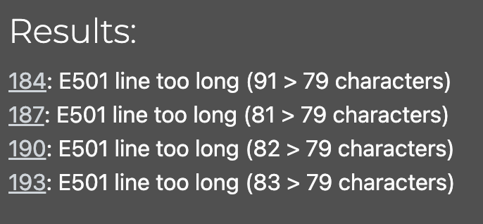

# Testing And Validation

## Contents

[Code Validation](#code-validation)

[Manual Testing](#manual-testing)

[Automated Testing](#automated-testing)

---

## Code Validation

### PEP8 Code Validation

PEP8 is the style guide for Python code, aiming to improve the readability and consistency of Python code. To ensure adherence to PEP8 standards, I used Code Institute's PEP8 Python Linter. This tool analyzes the code and highlights deviations from the PEP8 guidelines, such as line length, indentation, and spacing issues. Running the linter helps maintain clean, readable, and professional code. By integrating this into the development process, I ensured that all Python files in the project comply with industry-standard coding practices, enhancing overall code quality and maintainability.

**ft_api Folder**

| Filename         | PEP8 Validation Status  | Notes                      |
|------------------|---------|--------------------------------------------|
| agsi.py          | Pass    |                                            |
| permissions.py   | Pass    |                                            |
| serializers.py   | Pass    |                                            |
| settings.py      | Fail    | Please see note bellow                     |
| urls.py          | Pass    |                                            |
| views.py         | Pass    |                                            |
| wsgi.py          | Pass    |                                            |

The settings.py file contains essential configuration settings, and while most of the code complies with PEP8 guidelines, a few lines exceed the 79-character limit due to the detailed configuration of password validators. These lines were not modified to ensure the clarity and readability of the settings, despite causing PEP8 warnings for line length.

---
**blogs Folder**

| Filename       | PEP8 Validation Status |
|----------------|------------------------|
| admin.py       | Pass                   |
| apps.py        | Pass                   |
| models.py      | Pass                   |
| serializers.py | Pass                   |
| tests.py       | Pass                   |
| urls.py        | Pass                   |
| views.py       | Pass                   |

---
**blog_likes Folder**

| Filename       | PEP8 Validation Status |
|----------------|------------------------|
| admin.py       | Pass                   |
| apps.py        | Pass                   |
| models.py      | Pass                   |
| serializers.py | Pass                   |
| tests.py       | Pass                   |
| urls.py        | Pass                   |
| views.py       | Pass                   |

---
**blog_comments Folder**

| Filename       | PEP8 Validation Status |
|----------------|------------------------|
| admin.py       | Pass                   |
| apps.py        | Pass                   |
| models.py      | Pass                   |
| serializers.py | Pass                   |
| tests.py       | Pass                   |
| urls.py        | Pass                   |
| views.py       | Pass                   |

---
**workouts Folder**

| Filename       | PEP8 Validation Status |
|----------------|------------------------|
| admin.py       | Pass                   |
| apps.py        | Pass                   |
| models.py      | Pass                   |
| serializers.py | Pass                   |
| tests.py       | Pass                   |
| urls.py        | Pass                   |
| views.py       | Pass                   |

---
**workout_likes Folder**

| Filename       | PEP8 Validation Status |
|----------------|------------------------|
| admin.py       | Pass                   |
| apps.py        | Pass                   |
| models.py      | Pass                   |
| serializers.py | Pass                   |
| tests.py       | Pass                   |
| urls.py        | Pass                   |
| views.py       | Pass                   |

---
**workout_comments Folder**

| Filename       | PEP8 Validation Status |
|----------------|------------------------|
| admin.py       | Pass                   |
| apps.py        | Pass                   |
| models.py      | Pass                   |
| serializers.py | Pass                   |
| tests.py       | Pass                   |
| urls.py        | Pass                   |
| views.py       | Pass                   |

---
**profiles Folder**

| Filename       | PEP8 Validation Status |
|----------------|------------------------|
| admin.py       | Pass                   |
| apps.py        | Pass                   |
| models.py      | Pass                   |
| serializers.py | Pass                   |
| tests.py       | Pass                   |
| urls.py        | Pass                   |
| views.py       | Pass                   |

---
**followers Folder**

| Filename       | PEP8 Validation Status |
|----------------|------------------------|
| admin.py       | Pass                   |
| apps.py        | Pass                   |
| models.py      | Pass                   |
| serializers.py | Pass                   |
| tests.py       | Pass                   |
| urls.py        | Pass                   |
| views.py       | Pass                   |

---
**feed Folder**

| Filename       | PEP8 Validation Status |
|----------------|------------------------|
| admin.py       | Pass                   |
| apps.py        | Pass                   |
| models.py      | Pass                   |
| serializers.py | Pass                   |
| tests.py       | Pass                   |
| urls.py        | Pass                   |
| views.py       | Pass                   |

---
**groups Folder**

| Filename       | PEP8 Validation Status |
|----------------|------------------------|
| admin.py       | Pass                   |
| apps.py        | Pass                   |
| models.py      | Pass                   |
| serializers.py | Pass                   |
| tests.py       | Pass                   |
| urls.py        | Pass                   |
| views.py       | Pass                   |

---
**group_events Folder**

| Filename       | PEP8 Validation Status |
|----------------|------------------------|
| admin.py       | Pass                   |
| apps.py        | Pass                   |
| models.py      | Pass                   |
| serializers.py | Pass                   |
| tests.py       | Pass                   |
| urls.py        | Pass                   |
| views.py       | Pass                   |

